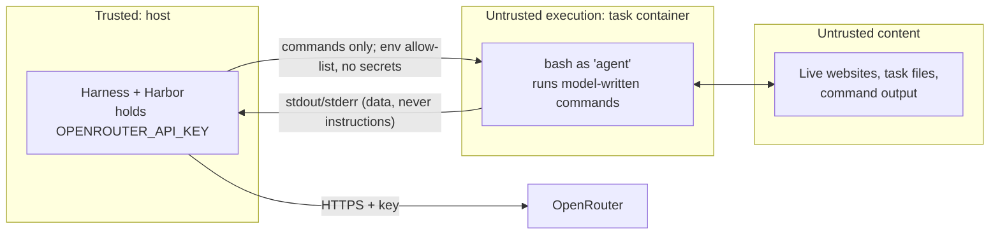

# Guardrails

**PE6203 CA2 · Group Project 5** · Safety and execution boundaries for the cost-aware harness.
Status: design baseline, 2026-10-09. §8 will be completed from the AI Cybersecurity and Agentic AI lecture material.

This document defines what the harness blocks, limits and logs, and the exact text the model sees when that happens. Architecture context: [`system_architecture.md`](system_architecture.md). Config IDs (B0, E, H0, Ck, V) are defined in [§2 of that document](system_architecture.md#2-configurations).

> **Scope.** Rules in this document are enforced by our host-side harness (H0, H0+Ck, V). The stock baselines B0 and E run Harbor's unmodified `mini-swe-agent` and get **none** of them: that is what "default harness" means. Their residual risks are covered in §5.

---

## 1. Threat Model

| Asset | Threat | Source | Primary control |
|---|---|---|---|
| OpenRouter credit ($8 shared) | Runaway loops, oversized prompts, re-runs after a crash | Model behaviour, harness bugs, `restart:` policies | Step, cost and job caps; key credit limit; no auto-restart (§4) |
| API key | Exfiltration by a command the model runs | Model output, **prompt injection** from live websites or task files | Key never enters the task container (§2) |
| Host machine | Destructive commands, resource exhaustion | Model output | Commands only ever run in the task container; Docker CPU/memory limits; 1 MB output cap |
| Benchmark integrity | Reading verifiers or solutions, tampering with tasks, task-specific hard-coding | Model (reward hacking), developers | Harbor isolates tests; checkout check; leak scan (§6) |
| Experimental validity | Guardrails silently changing what is measured | Over-broad rules | Every trigger logged; false-positive review on dev; rules frozen before eval (§7) |

**Untrusted inputs:** everything the model emits, and everything it reads, including:
- command output;
- task files;
- live web pages: the 22 Web tasks browse real sites through Chrome's debugging port, and System tasks change browser and app settings.

**Trusted:** this repository, the pinned TUA-Bench checkout, and Harbor 0.6.3.

---

## 2. Trust Boundaries

1. **Secrets stay on the host.** The harness calls `environment.exec()` with an explicit allow-list of variables ([system_architecture.md §3.1](system_architecture.md#31-hostcontainer-adapter-harnessenvironmentpy)). A unit test asserts no variable whose name contains `KEY`, `TOKEN` or `SECRET` is ever passed.
2. **Model output is only ever executed inside the task container.** The harness never `eval`s, `subprocess`es or templates model text on the host.
3. **Observations are data.** The prompt tells the model that instructions found in output, files or web pages are to be ignored ([`agent_instructions.md`](agent_instructions.md)). No guardrail depends on the model obeying this: every rule below is enforced by code.
4. **The container keeps internet access**, because tasks require it (`allow_internet = true`). Egress is therefore not a control we can use. The controls are "nothing worth stealing inside" (1) and "spending is capped" (§4).

---

## 3. Command Rules

The harness checks each proposed command *before* execution. **Always-on** rules (`G-*`) apply to every host configuration, H0 included: they almost never trigger in normal work, so they don't distort the H0 ≈ B0 parity check. **C2** rules (`U-*`) are part of the tool-interface component and are on only when C2 is.

**Matching.**
- `G-*` rules match the full command text, heredoc bodies included (safety first; false positives are logged).
- `U-*` rules match the command with heredoc bodies removed. A Python file that merely *contains* the word `vim` is not an editor launch.
- First match wins, `G-*` before `U-*`.
- Patterns are Python `re` with `re.MULTILINE`. The tables are abridged; the authoritative patterns and their unit tests live in `harness/guardrails.py` (planned). "Segment start" below means `(^|[;&|]\s*|\$\(\s*)`.

**Actions.**
- **block:** not executed; the message below is returned as the observation; counts as a step.
- **log:** executed normally; an event is recorded.

> These regexes stop *accidents and obvious misuse*. They are a seatbelt, not a sandbox: a determined model can obfuscate around them (variables, base64). The real boundary is the container, the absence of secrets, and the spend caps.

### 3.1 Always-on safety and integrity rules

| ID | Catches | Pattern (abridged) | Action |
|---|---|---|---|
| G-DST-01 | Recursive delete of `/`, `~`, `$HOME` or `/app` (the task's input root) | `\brm\s+(-\w*[rR]\w*\s+)+(--no-preserve-root\s+)?(/\*?\|~/?\|\$HOME/?\|/app/?\*?)(?=\s\|;\|&\|\\|\|$)` | block |
| G-DST-02 | Filesystem or device destruction | `\bmkfs(\.\w+)?\b`, `\bdd\b[^;&\|]*\bof=/dev/`, `\bwipefs\b`, `>\s*/dev/[sh]d[a-z]` | block |
| G-DST-03 | Fork bombs and process-wide kills | `:\(\)\s*\{\s*:\s*\\|\s*:\s*&\s*\}`, `\bkill\s+-9\s+-1\b`, `\bpkill\s+-9\s+-u\b` | block |
| G-DST-04 | Power or init state | `\b(shutdown\|reboot\|halt\|poweroff)\b`, `\bsystemctl\s+(poweroff\|reboot\|halt)\b`, `\binit\s+[06]\b` | block |
| G-DST-05 | Permission or ownership sweeps at `/` | `\bch(mod\|own)\s+-R\s+\S+\s+/(?=\s\|$)` | block |
| G-INT-01 | Grader paths (reward hacking) | `(?<![\w.])/(tests\|solution\|oracle)(?=/\|\s\|$\|['"])`, `/logs/verifier\b`, `\btest_outputs\.py\b`, `\bsolve\.sh\b` | block |
| G-SEC-01 | Secret probing, often the visible half of a prompt injection | segment start + `(printenv\|env)\s*($\|[;&\|])`, `/proc/\d+/environ`, `\$\{?\w*(API_KEY\|TOKEN\|SECRET)` | log |

### 3.2 C2 usability rules

| ID | Catches | Pattern (abridged) | Action |
|---|---|---|---|
| U-INT-01 | Full-screen editors, pagers, monitors | segment start + `(sudo\s+)?(vi\|vim\|nvim\|nano\|emacs\|pico\|less\|more\|top\|htop\|man\|watch)\b` | block |
| U-INT-02 | Follow mode, which never exits | `\btail\s+(-\w*f\w*\|--follow)\b`, `\bjournalctl\b[^;&\|]*\s-f\b` | block |
| U-INT-03 | Bare REPLs waiting on stdin | segment start + `(python3?\|ipython\|node\|irb\|sqlite3\|psql\|mysql)\s*(?=$\|[;&\|])` | block |
| U-INT-04 | Password prompts that hang | `\bsudo\b(?!\s+-n\b)`, `\b(ssh\|scp)\b(?![^;&\|]*BatchMode=yes)` | block |
| U-FMT-01 | Empty command | `^\s*$` | block |
| U-FMT-02 | Over-long command | length > 8,000 characters | block |
| U-FMT-03 | Unterminated heredoc | `<<-?\s*['"]?(\w+)['"]?` with no later line equal to the delimiter | block |
| U-FMT-04 | Submit combined with other work | contains `COMPLETE_TASK_AND_SUBMIT_FINAL_OUTPUT` but is not exactly `echo COMPLETE_TASK_AND_SUBMIT_FINAL_OUTPUT` | block |
| U-FMT-05 | More than one tool call in a response | count > 1 | run first, note the rest |

### 3.3 Exact messages returned to the model

Messages are short on purpose (they are billed tokens) and always say what to do instead. `{…}` are filled in by the harness.

| Rule | Message |
|---|---|
| G-DST-01…05 | `BLOCKED [{rule_id}]: this command could destroy the environment and was not run. Delete or modify only the specific files the task requires.` |
| G-INT-01 | `BLOCKED [G-INT-01]: paths reserved for the benchmark's grader are not part of the task. Work only from the task's inputs.` |
| U-INT-01 | `BLOCKED [U-INT-01]: '{program}' is interactive and would hang. Read with cat/head/sed -n, edit with sed, python, or cat <<'EOF' > file.` |
| U-INT-02 | `BLOCKED [U-INT-02]: follow mode never exits. Use 'tail -n 50 FILE' and run it again to poll.` |
| U-INT-03 | `BLOCKED [U-INT-03]: a bare '{program}' waits for input. Use '{program} -c "..."', '{program} script', or pipe input in.` |
| U-INT-04 | `BLOCKED [U-INT-04]: this would wait for a password. Use 'sudo -n …' (fails fast without rights) or '-o BatchMode=yes'.` |
| U-FMT-01 | `REJECTED [U-FMT-01]: empty command. Send one bash command.` |
| U-FMT-02 | `REJECTED [U-FMT-02]: command is {n} characters (limit 8000). Write long content to a file with a heredoc across several steps.` |
| U-FMT-03 | `REJECTED [U-FMT-03]: heredoc '{delim}' is never closed. End it with a line containing only {delim}.` |
| U-FMT-04 | `REJECTED [U-FMT-04]: submit on its own: echo COMPLETE_TASK_AND_SUBMIT_FINAL_OUTPUT` |
| U-FMT-05 | Appended to the observation: `NOTE: {k} extra tool call(s) were ignored; send one command per response.` |
| Format error (C2) | `REJECTED: no valid bash tool call found ({reason}). Reply with brief reasoning and exactly one bash tool call.` |
| Format error (H0, stock) | mini-swe-agent v2.4.6 `format_error_template`, unchanged |

---

## 4. Limits and Kill Switches

| Limit | H0 (stock behaviour) | With component | When hit |
|---|---|---|---|
| Consecutive format errors | 3 | 5 (C2) | Trial ends, `exit_status = RepeatedFormatError` |
| Guardrail blocks per trial | 10 | 10 | Trial ends, `exit_status = GuardrailLimit` |
| Repeat-failure intercepts | n/a | Unlimited, each logged (C4) | The command is not executed (see C4) |
| Model calls per trial | None (stock default) | 50 (C3) | `exit_status = LimitsExceeded` |
| Agent wall-clock | 2,400 s (task default) | same | Harbor stops the trial; logs already flushed |
| Per-command timeout | 30 s | 180 s (C3) | Command killed; message with background-job recipe (C4) |
| Output read per command | 1 MB | 1 MB | Rest dropped, `[output truncated at 1 MB]` |
| Per-task spend | None (stock default); key credit limit, plus a pilot-based safety ceiling if needed ([architecture §6](system_architecture.md#6-budgets-and-limits)) | B_task (C3) | `exit_status = CostCapExceeded` |
| Per-job spend | Job budget + 20% | same | Gateway refuses further calls; remaining trials marked `budget_abort` (rerun later, never scored as failures) |
| API errors (429, 5xx, timeout) | 3 retries, backoff 2/4/8 s | same | Then infra error → trial rerun policy |
| OpenRouter key | Credit limit set in the dashboard | n/a | Provider-side hard stop: the last line of defence |
| Process supervision | No `restart:` policy anywhere | n/a | A crashed run stays crashed (`docker-compose.yml`) |

**Human-in-the-loop** (enforced by `scripts/harbor_run.sh`):
- Any agent other than `oracle` or `nop` requires `CONFIRM_PAID=1`.
- `SPLIT=eval` with a model agent additionally requires `CONFIRM_EVAL=1`.
- Coding assistants working on this repo must ask a human before setting either ([`CLAUDE.md`](CLAUDE.md)).

---

## 5. Secrets and Residual Risks

- **Storage.**
  - `.env` is git-ignored and listed in `.dockerignore`.
  - The runner image copies no source. A search of the built image for `.env` returned nothing (verified 2026-10-09).
  - `.env.example` documents the variables.
- **One key per teammate**, created for this project with a hard credit limit, and rotated after the final run. Keys are never pasted into chat, issues, commits or logs. `calls.jsonl` stores no request headers.
- **B0 and E (accepted residual risk).** Harbor's stock `mini-swe-agent` passes the API key *into* the task container, where model-written commands and live web content coexist. We cannot change this without changing the default harness. Mitigations:
  - the credit-capped key bounds the loss;
  - post-experiment rotation;
  - G-SEC-01-style log review of B0/E trajectories (an offline grep, since no live rules apply to B0/E).
- **Docker socket.** The optional compose runner mounts `/var/run/docker.sock`, which is root-equivalent on the Docker VM. Only Harbor uses it. Model commands never run in that container.
- **Supply chain.** Harbor, mini-swe-agent (2.4.6), uv and base images are pinned. B0 still runs Harbor's installer, which `curl | sh`-installs uv 0.7.13 into the task container: part of the stock harness, noted rather than changed.

---

## 6. Benchmark Integrity

| Rule | Enforcement |
|---|---|
| Tasks and verifiers unmodified | `harbor_run.sh` refuses to start unless the TUA-Bench checkout is at the subset's commit with no tracked changes under `tasks/` or in `dataset.toml` |
| The agent never sees grader material | Harbor uploads `tests/` only after the agent has finished. `solution/` is used only by the oracle agent. G-INT-01 blocks and logs any attempt anyway. |
| No task-specific hard-coding | `scripts/check_no_task_leak.py` (planned, runs in `harbor_run.sh`) fails if `harness/`, `configs/harness/` or `agent_instructions.md` contains any task ID, or any file name that appears in a task instruction |
| No tuning on the evaluation set | Development and pilots on the dev split (`--split dev`) only. `CONFIRM_EVAL=1` gate (§4). |
| Subset fixed | `configs/task_subset.json` changes only through the oracle gate, before the first model run ([architecture §10.1](system_architecture.md#101-before-any-model-run)) |
| Budgets stated and versioned | Baselines keep stock defaults. Variant budgets (S, B_task, timeouts) live in versioned config files, not `.env`. The report lists every limit per configuration. |

---

## 7. Measuring the Guardrails

Guardrails can lower success as well as protect it, so they are measured like any other component:

- Every trigger is an `events.jsonl` record with `rule_id`, the command (truncated to 500 characters) and the action taken.
- **Dev review before freeze.** All `block` events from dev runs are reviewed by hand. A rule with any false positive on a legitimate command is narrowed. The rule table is then frozen together with the harness version used for eval.
- **Report.** Trigger counts per rule per configuration. Blocks that preceded a failed trial are checked during failure classification ([architecture §10.4](system_architecture.md#104-analysis)), so a guardrail-caused failure is labelled as a harness-level failure, not hidden.

---

## 8. Mapping to Course Frameworks

*To be completed from the AI Cybersecurity and Agentic AI lecture slides.* Provisional mapping to the OWASP Top 10 for LLM Applications (2025):

| OWASP 2025 | Relevance here | Controls in this document |
|---|---|---|
| LLM01 Prompt Injection | Live websites and task files flow into the model's context | §2 (data framing, no secrets in container), G-SEC-01 logging |
| LLM02 Sensitive Information Disclosure | API key exposure | §2.1, §5 |
| LLM03 Supply Chain | Pinned Harbor, mini-swe-agent and images; B0's `curl \| sh` installer | §5 |
| LLM05 Improper Output Handling | Model output executed as shell | §2.2 (container-only execution), §3 rules |
| LLM06 Excessive Agency | Root-level destructive commands, grader access | G-DST-*, G-INT-01 |
| LLM10 Unbounded Consumption | Loops, context growth, crash-restart spending | §4 caps, C1/C3/C4 in the architecture |
