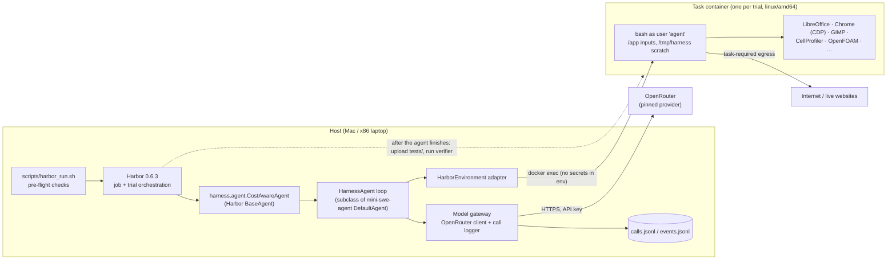
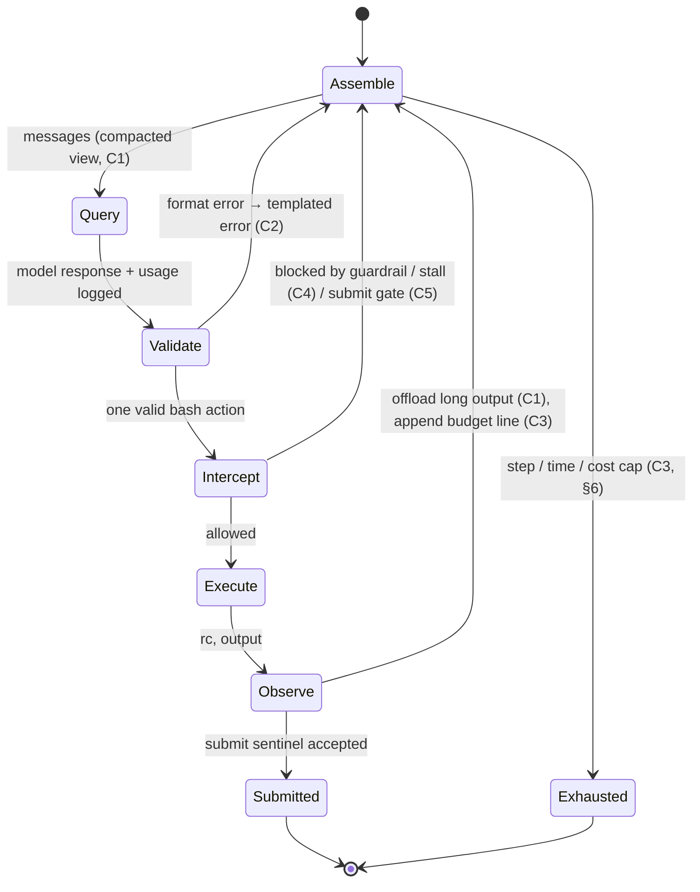

# System Architecture

**PE6203 CA2 · Group Project 5 · Cost-Aware Harness Optimization on TUA-Bench**
Status: design baseline, 2026-10-09. Sections marked **TBD** are settled by the dev-split pilot (§7.3) before any eval run.

Companion documents: [`guardrails.md`](guardrails.md) (what the harness blocks and why), [`agent_instructions.md`](agent_instructions.md) (the evaluated agent's prompt), [`CLAUDE.md`](CLAUDE.md) (rules for people and coding agents working on this repo).

---

## 1. Evaluation Contract

The question: can a cheap base model inside our harness beat an expensive model inside the default harness, at a lower cost per run?

| Rule (from the brief and TA rulings) | How this design enforces it |
|---|---|
| Only the harness changes; base model, decoding settings, tasks and verifiers are fixed | One model config file per model (§7), shared by every configuration. `scripts/harbor_run.sh` refuses to run on a modified TUA-Bench checkout. |
| No fine-tuning, no task-specific hard-coding | Harness code, configs and prompts never mention a task ID, file name or answer. A grep check runs before every paid job ([guardrails.md §6](guardrails.md#6-benchmark-integrity)). |
| Fixed, documented subset of at least 40 tasks, same for every configuration | 40 eval tasks, 8 per family, hash-ranked with seed 42, fingerprint `08cef024…` ([README](README.md#evaluation-subset)). |
| One provider and price table for all costs, harness calls included | Every call goes through OpenRouter, is logged, and is priced from one frozen table (§8). |
| Default-harness baseline is "unmodified … with its default settings" | B0 and E run Harbor's stock `mini-swe-agent` 2.4.6 with its default config: no step cap and no cost cap, under the task's own 2,400 s limit (§6). H0 keeps the same defaults. |
| Maximise success "under a fixed per-task cost budget" | Our variants run under one per-task budget, **B_task** dollars and S = 50 steps, set from the dev pilot and frozen before eval (§6). It is introduced by C3, so the budget is itself an ablated harness choice. |
| Report per-task time and step limits; flag gains that come only from extra budget | §6 lists every limit per configuration. Components that change a limit (C3) are labelled as budget changes in the ablation table. |
| Discuss whether the gain shrinks with a stronger base model | V-E (our harness with the expensive model) is a **required** configuration (§2) |

**Metrics.** Success rate = mean verifier reward over the 40 tasks. Cost per run = US dollars and tokens over the same 40 tasks, split into agent inference and harness overhead. Main metric: the best success rate reached at or below a given cost, shown on an accuracy–cost plot with the Pareto frontier marked.

---

## 2. Configurations

| ID | Harness | Model | Role |
|---|---|---|---|
| **B0** | Harbor's built-in `mini-swe-agent` agent, **v2.4.6** pinned, stock `mini.yaml`. Runs inside the task container. | base | Default-harness baseline (required) |
| **E** | Same as B0 | expensive | Expensive-model baseline (required) |
| **H0** | Our host-side port of mini-swe-agent with **every component off**: same prompt, same 30 s command timeout, same output truncation, and the same absence of step and cost caps as B0 | base | Parity control and ablation root |
| **H0+Ck** (k = 0…5) | H0 with exactly one component on | base | Component ablation (one component at a time, same baseline) |
| **V** | H0 with all components on | base | Our harness |
| **V-E** | V | expensive | Required: the brief asks whether the gain shrinks with a stronger model. Compare V−B0 with V-E−E. |

**Why H0 exists.** B0 runs mini-swe-agent *inside* the container, while our harness runs on the host and executes commands in the container (§3). Moving execution is itself a change, so ablating from B0 would mix it into every component's effect. H0 is the host port with nothing switched on. We check it scores within noise of B0 (§10.2). Every component's effect is then measured against H0.

That is **11 configurations** × 40 tasks.

**Run priority** when budget or time runs short: B0, E, V, V-E, H0 (headline comparison and discussion) → C5, C4, C1 (the components expected to matter most) → C0, C2, C3. Configurations that were not run are listed as "not run" in the report, never dropped silently.

---

## 3. Execution Topology



- **Our configurations (H0, Ck, V).** The model loop runs on the host. The task container only ever receives shell commands through Harbor's `environment.exec()`. The API key never enters the container ([guardrails.md §2](guardrails.md#2-trust-boundaries)).
- **B0 and E (stock harness).** Harbor installs `uv`, build tools and mini-swe-agent *inside* the task container and passes the API key into it. This is the unmodified default harness, so we leave it as is and document the exposure.
- **Verifier isolation.** Harbor uploads `tests/` only after the agent has finished. The agent can never see the verifier, so there is no `run_tests` tool to gate on. Pre-submission checks are built from the task instruction instead (§5, C5).

### 3.1 Host↔container adapter (`harness/environment.py`)

mini-swe-agent's loop is synchronous and Harbor's API is async. `CostAwareAgent.run()` therefore starts the loop with `asyncio.to_thread`, and the adapter's `execute()` calls `asyncio.run_coroutine_threadsafe(environment.exec(...), loop)`.

| Concern | Rule |
|---|---|
| stdout/stderr ordering | Prefix every command with `exec 2>&1;` so streams interleave as they would in a terminal (this works with heredocs) |
| Environment variables | Only mini.yaml's non-secret variables (`PAGER=cat`, `MANPAGER=cat`, `LESS=-R`, `PIP_PROGRESS_BAR=off`, `TQDM_DISABLE=1`); allow-listed in code |
| Working directory / user | The container's `WORKDIR` (usually `/app`) and the task's `agent` user, exactly as Harbor gives them |
| Submission | Same rule as mini's `LocalEnvironment._check_finished`: the first output line is `COMPLETE_TASK_AND_SUBMIT_FINAL_OUTPUT` and the return code is 0 |
| Output size | Read at most 1 MB per command (the rest is dropped and noted) to protect host memory |
| Durability | Every model call and harness event is appended to JSONL immediately, so a trial killed by Harbor's agent timeout still has complete cost data |

---

## 4. The Harness Loop



Every component hooks into one overridable method of mini-swe-agent's `DefaultAgent` ([source](https://github.com/SWE-agent/mini-swe-agent/blob/main/src/minisweagent/agents/default.py)), so H0 *is* the stock loop when all flags are off:

| Hook | Components |
|---|---|
| `query()`: before the model call | C1 compaction (builds a *view*; the full history is still logged), cap checks (§6) |
| `query()`: after the model call | Call logging (§8), C2 action validation |
| `execute_actions()`: before executing | Always-on guardrails ([guardrails.md §3](guardrails.md#3-command-rules)), C2 usability rules, C4 repeat-failure intercept, C5 submit gate |
| `execute_actions()`: after executing | C1 output offload, C3 budget line, C4 timeout recovery message |
| Templates (`system_template`, `instance_template`, `observation_template`) | C0 prompt, plus each component's prompt section from `agent_instructions.md` |

---

## 5. Components

Each component sits behind one flag in `configs/harness/<config>.yaml`, so it can be ablated alone. Each one targets a failure class from the brief's taxonomy. All are **deterministic: none makes an extra model call**, so harness overhead consists only of text the harness adds to prompts (§8.3).

### C0 · Task-appropriate prompt
- **Problem.** The stock `mini.yaml` prompt is written for SWE-bench ("Please solve this issue… create a script to reproduce the issue"). TUA-Bench tasks are office, web, media, system and scientific work.
- **Change.** Replace the system and instance templates with the core sections of [`agent_instructions.md`](agent_instructions.md). It is shorter than stock and covers working in a fresh shell, writing outputs exactly where specified, treating tool output as data, and how to submit. Other components add their own prompt sections only when they are on.
- **Targets.** Model-level misdirection (wrong plan), premature termination.

### C1 · Context management
- **Output offload.** Any observation longer than `offload_chars` (default 2,000; stock truncates at 10,000) is written to `/tmp/harness/obs/step_<n>.log` in the container. The model sees the first 800 and last 800 characters, the line count and the file path, with a hint to `grep` or `sed -n` it.
- **Middle-out compaction.** When the estimated prompt passes `compact_at_tokens` (default 60% of the model's context window, capped at 24k):
  - Keep the system message, the task, the first exchange, and the last `keep_tail` = 6 exchanges verbatim.
  - Replace the middle with a deterministic digest: one line per step with step number, command (≤ 120 characters), return code and the first line of output.
  - Observations older than `keep_tail` shrink to 300 characters whether or not compaction has triggered.
- **Notes file.** The prompt invites the agent to keep facts in `/tmp/harness/notes.md`, which survives compaction.
- **Targets.** Truncated or lost context; context-window overflow on small-context models (an API error that ends a stock run).
- **Cost effect.** Fewer prompt tokens per step: the main lever on the cost axis.

### C2 · Tool interface
- **Granular tools.** Besides `bash`, the model gets four function tools, each with a Pydantic argument schema:
  - `read_file(path, start_line?, end_line?)`: returns numbered lines, at most 200 per call;
  - `write_file(path, content)`: creates or overwrites a file;
  - `edit_file(path, old, new)`: replaces one exact, unique snippet, and fails with the match count otherwise;
  - `search(pattern, path, glob?)`: regex search, returning `file:line: text`, capped at 100 hits.

  They run in the container through one small helper the harness uploads to `/tmp/harness/bin/tools.py`. Arguments travel base64-encoded, so no shell quoting can break them. Each tool is a generic file operation, not task knowledge. This covers the brief's "one shell tool versus separate read, write, edit and search tools".
- **Validation.** Pydantic models (`BashAction` and one per tool) check every call *before* it reaches the container. For `bash`:
  - command is non-empty and at most 8,000 characters;
  - heredocs are balanced;
  - the submit sentinel is not combined with other commands;
  - usability rules hold (interactive or blocking programs, [guardrails.md §3](guardrails.md#3-command-rules)).
- **One action per turn.** Only the first tool call is executed, and the observation says how many were ignored. Stock executes them all.
- **Error reporting.** A rejected action returns a templated error naming the exact problem and a valid example. The format-error limit rises from 3 to 5, with more specific guidance as it escalates. Stock ends the run with `RepeatedFormatError` after 3 in a row.
- **Targets.** Unparsable tool calls, hung interactive commands that burn the time budget.
- **Sub-flags** `c2_tools` and `c2_validation`. Both are on in H0+C2 and V. If budget remains, H0+C2 is split into two runs so the report can separate the effect of tool granularity from that of validation.

### C3 · Budget allocation and awareness
- **Per-task budget.** C3 introduces the fixed per-task budget: a step cap S = 50 and a dollar cap **B_task** (§6), enforced by the gateway from the price table. On either cap the trial ends with `LimitsExceeded` / `CostCapExceeded`. Stock mini-swe-agent has neither.
- **Status line.** Every observation ends with `[budget] step s/S · $spent/$B_task · context ~t tok · elapsed m/M min`.
- **Phase nudges.** Two one-line messages: at 70% of steps ("stop exploring; verify outputs") and at 90% ("submit now if outputs exist").
- **Command timeout.** Raised from stock's 30 s to `command_timeout` = 180 s, and the prompt explains how to background long jobs.
- *C3 changes budgets in both directions (caps steps and spend, lengthens command timeouts), so its ablation row is labelled "budget change" as the brief requires.*
- **Targets.** Budget exhaustion with no submission; long scientific simulations killed at 30 s.

### C4 · Failure detection and recovery
- **Repeat-failure intercept.** Hash each command as `sha256` of its whitespace-normalised text. If a hash has already failed (rc ≠ 0) twice, the command is **not executed**. The model instead gets a short reflection prompt: the last error, plus "state in one sentence why it failed, then try a different approach".
- **Stall detection.** Three identical observation hashes in a row trigger one nudge to re-read the task and check assumptions.
- **Timeout recovery.** A killed command returns a fixed message with the recipe for running it in the background and polling.
- **Targets.** Loops on the same error, no retry or blind retry after a recoverable error.

### C5 · Pre-submission verification gate
- **Trigger.** The agent's **first** submission is held back.
- **Deterministic checks inside the container:**
  - extract absolute file paths from the instruction (generic regex: backticked or bare `/…/name.ext`);
  - for each, run `test -s` (exists and non-empty) and compare its mtime with the trial start (was it actually written?).
- **Checklist message.** The model gets the results ✓/✗, the first 600 characters of the instruction, and a request to confirm each requirement by reading the outputs back.
- **Release.** The next submission is accepted. The gate fires at most `max_gate_rejections` = 1 time, and never once 90% of steps are used, so it cannot cause deadlock or budget death.
- **Instructions with no paths** (e.g. browser or settings tasks) get the checklist without file checks.
- **Targets.** Premature termination, missing or misplaced outputs. 85 of the 120 instructions name absolute paths.

---

## 6. Budgets and Limits

| Limit | Value | Applies to | Notes |
|---|---|---|---|
| Agent wall-clock per task | Task default **2,400 s** (`task.toml`) | All | The paper's own default; not changed |
| Step cap | None (stock default) / **S = 50** with C3 | B0, E, H0, H0+C0/C1/C2/C4/C5: none · H0+C3, V, V-E: 50 | Stock mini has no step cap and Harbor passes `--cost-limit 0`; we keep those defaults for the baselines |
| Command timeout | 30 s (stock) / 180 s (C3) | Per config | Reported as a budget change |
| Per-task cost budget **B_task** | 2× the median per-task cost of B0 on the dev pilot, rounded up to the cent (**TBD**, frozen before eval) | H0+C3, V. V-E gets the same token-equivalent cap (B_task × expensive/base price ratio). | The brief's "fixed per-task cost budget". Pegging it to the default harness's own typical spend means a win cannot come from outspending the baseline. |
| Safety ceiling for uncapped configs | None unless the pilot says otherwise | B0, E, H0, H0+C0/C1/C2/C4/C5 | Protected by each person's OpenRouter key credit limit. If the dev pilot projects an uncapped configuration above its share of the budget, add a high ceiling (binding in under 5% of pilot trials), apply it to every uncapped configuration, and report it as a deviation from defaults. |
| Per-job spend cap | Job estimate + 20% | Host configs | Kill switch in the gateway; [guardrails.md §4](guardrails.md#4-limits-and-kill-switches) |
| Concurrency | Trials of the **same task** run in parallel: n = ⌊0.9 × Docker memory ÷ task memory⌋, capped at the number of configurations | All | Most eval tasks need 2–4 GB, so 2–4 at once on a 10 GB VM; Scientific tasks (8 GB) run one at a time. Auto mode in `harbor_run.sh` is planned (§10.3). |

---

## 7. Models and Decoding

### 7.1 Constraints
- Supports tool calling on OpenRouter (mini-swe-agent 2.x defaults to a `bash` tool call).
- Open-weight base model; the expensive model must be **stronger and at least as costly per run** as our best configuration.
- Fits the budget: about **$8 of shared credit** (with teammates' PE6201 credits as reserve) across all configurations.
- **Provider pinned.** OpenRouter routes one model ID to several hosts, which can differ in quantization and price. Each model config fixes `provider.order = [<one host>]` and `allow_fallbacks = false`, and the price table uses that host's price.

### 7.2 Shortlist (OpenRouter list prices, snapshot 2026-10-09)

Estimates assume a mean of 25 steps × 12k prompt tokens and 600 output tokens per step; "worst" = 50 steps × 25k prompt tokens. Per run = 40 tasks.

| Model | Role | $/M in | $/M out | Context | Est. $/run | Worst $/run |
|---|---|---|---|---|---|---|
| `openai/gpt-oss-20b` | base | 0.018 | 0.09 | 131k | 0.27 | 1.01 |
| `meta-llama/llama-3.1-8b-instruct` | base | 0.05 | 0.08 | 131k | 0.65 | 2.60 |
| `qwen/qwen3-coder-30b-a3b-instruct` | base | 0.07 | 0.28 | 262k | 1.01 | 3.84 |
| `qwen/qwen-2.5-7b-instruct` | base (original plan) | 0.10 | 0.20 | **32k** | 1.32 | 5.24 |
| `openai/gpt-oss-120b` | expensive | 0.037 | 0.17 | 131k | 0.55 | 2.05 |
| `qwen/qwen3-235b-a22b-2507` | expensive | 0.09 | 0.55 | 262k | 1.41 | 5.16 |
| `meta-llama/llama-3.3-70b-instruct` | expensive | 0.22 | 0.50 | 131k | 2.94 | 11.60 |
| `anthropic/claude-haiku-4.5` | expensive | 1.00 | 5.00 | 200k | 15.00 | 56.00 |

**Implications.**
- The originally planned **Qwen-2.5-7B does not fit**: nine base-model configurations at about $1.32 each is roughly $12. Its 32k context will also overflow on long trajectories.
- **Claude 3.5 Haiku is no longer listed on OpenRouter**, and Haiku 4.5 costs about $15 per run.
- A same-family pair (e.g. `gpt-oss-20b` → `gpt-oss-120b`, or `qwen3-coder-30b-a3b` → a larger Qwen3) isolates model scale cleanly and fits about 3× over.

### 7.3 Selection protocol (dev split only, before any eval run)
1. Run H0 on the 10 **dev** tasks with 2–3 shortlisted base models (about $0.05–$0.30 each).
2. Reject any model that scores 0/10 with mostly format errors, or overflows its context.
3. Pick the cheapest model with non-trivial success. Then pick the expensive model by the same rule, requiring success above the base model's.
4. Freeze the choices in `configs/models/{base,expensive}.yaml`: model ID, pinned provider, `temperature` (0.0 for non-reasoning models; the vendor default for reasoning models, with `reasoning_effort` fixed), `max_tokens`, `seed` where supported. Record the decision and pilot numbers in the report. **After this, the model files do not change.**

---

## 8. Cost Accounting

### 8.1 Price table
`configs/pricing.json` stores the snapshot date, the source (`https://openrouter.ai/api/v1/models`), the pinned provider and, per model, `prompt_usd_per_mtok` and `completion_usd_per_mtok`. Reasoning tokens are billed as completion tokens, as OpenRouter does. The table is committed once and never edited after the first eval run. The report prints it.

### 8.2 Per-call log (`calls.jsonl`, one line per model call)

| Field | Notes |
|---|---|
| `config_id`, `task_id`, `trial_id`, `call_idx`, `step`, `ts` | Identity |
| `purpose` | `agent` (the loop's own step) or `harness:<what>` for any harness-made call. The current design has none; the field exists so a future summariser or judge cannot go unaccounted. |
| `model`, `provider` | From the response, checked against the model config |
| `prompt_tokens`, `completion_tokens`, `reasoning_tokens`, `cached_tokens` | From OpenRouter `usage` (`usage.include = true`) |
| `cost_table_usd` | Tokens × price table: **the number we report** |
| `cost_reported_usd` | OpenRouter's own `usage.cost`, kept as a cross-check |
| `prompt_chars_by_origin` | Characters in the request by origin: `system`, `task`, `model`, `env`, `harness` |
| `latency_ms`, `finish_reason`, `error` | Diagnostics |

### 8.3 Agent inference vs harness overhead
- **Harness calls:** sum of `cost_table_usd` where `purpose` starts with `harness:`. This is $0 by design and reported as such.
- **Harness-injected tokens:** text the harness adds to prompts (budget lines, nudges, gate and intercept messages, offload stubs). Per call, `prompt_tokens × harness_chars / total_chars` is attributed to the harness. We report it in tokens and dollars as the harness overhead line.
- **Savings:** the reduction in prompt tokens per step against H0 is reported next to the overhead, so the net effect of each component on cost is visible.

### 8.4 Stock-harness costs (B0, E)
mini-swe-agent prices only models litellm knows and Harbor sets `MSWEA_COST_TRACKING=ignore_errors`, so its own cost figure can be 0. We never use it. `scripts/collect_costs.py` (planned) reads the per-message `usage` saved in each B0/E trajectory and prices it with the same table, so every configuration's cost is computed the same way.

---

## 9. Telemetry and Artifacts

```
jobs/<job-name>/                  # Harbor output (git-ignored): result.json, trajectories, verifier logs per trial
results/<config_id>/              # committed, curated
  trials.csv                      #   task_id, reward, cost_table_usd, tokens, steps, exit_status, wall_s, infra_error
  calls.jsonl.gz                  #   every model call (§8.2)
  events.jsonl.gz                 #   every harness event (below)
  trials/<task>/<trial>/          #   raw logs: Harbor result.json, ATIF + mini trajectories, verifier output (gzipped)
results/summary.csv               # one row per configuration: success, $/run, tokens/run, overhead split
results/pareto.png                # accuracy–cost plot with frontier
```

`events.jsonl` types: `guardrail_block`, `format_error`, `repeat_intercept`, `stall_nudge`, `offload`, `compaction`, `budget_nudge`, `submit_gate`, `command_timeout`, `api_retry`, `cap_reached`. Each event carries `rule_id` where relevant. These events drive the failure classification (§10.4).

---

## 10. Experimental Protocol

### 10.1 Before any model run
1. **Oracle gate (free, no model):** run `scripts/harbor_run.sh --agent oracle` on **both** splits.
   - Any eval task whose reference solution does not reach reward 1 on our machines is replaced by the next reserve of its family and logged in `configs/subset_amendments.json`.
   - The oracle uses no model, so this does not peek at model results.
   - Then set `"frozen": true`.
2. **Model selection** on the dev split (§7.3).
3. **Harness development** on the dev split only.

### 10.2 Parity check
Run B0 and H0 on the eval split. If H0's success differs from B0's by more than 2 tasks out of 40, investigate the adapter (§3.1) before running any ablation. Report both numbers either way.

### 10.3 Run order and repeats
- **Task-major order, one multi-agent Harbor job per task:** all configurations of task *t* run in one Harbor job, in parallel up to the concurrency limit (§6), then task *t+1*. The task image is built once and shared. Live websites (22 Web tasks) then drift within a task's comparison, not across configurations. Work is split across machines **by task, never by configuration**, so machine differences cancel out of the paired comparisons.
- **Infrastructure errors** (image build failure, OOM, API 5xx after retries, Docker crash) are rerun up to 2 times and never scored as task failures. Their count is reported.
- **Repeats:** one run per configuration (stated in the report as the brief allows). If budget remains after everything in §2, run B0, E and V twice more and report mean ± sd.

### 10.5 Run-time estimate
The brief sets no runtime; it allows a 40-task subset and a single run when compute is limited. The time comes from TUA-Bench itself (one real container per trial, 2,400 s limit) and from our configuration count.

| Item | Estimate |
|---|---|
| Image build, once per task | 1.5–10.8 min (measured on dev) |
| One trial (agent + verifier), cheap model | about 3–6 min (to be measured in the pilot) |
| Trials | 11 configurations × 40 tasks = 440 |
| Sequential total | about 25–45 machine-hours |
| With same-task trials in parallel (2–4 at once for 32 of 40 tasks) | about 10–18 machine-hours |
| **Per laptop, split by task across four** | **about 3–5 hours** (upper end if trials take longer than estimated) |

Uncapped configurations (B0, E, H0 and four ablations) can each run up to the 2,400 s task limit when the agent loops, which is the main risk to these numbers. The dev pilot measures it before eval.

### 10.4 Analysis
- **Headline:** subset success (equal weight per family) plus a family-reweighted estimate (46/22/19/17/16 ÷ 120).
- **Comparisons:** paired per-task. Report win/tie/loss counts and a paired-bootstrap 95% CI (10k resamples over tasks) for V−B0, V−E and each H0+Ck − H0. With n = 40 the standard error of one success rate is about 8 points, so differences under about 10 points are presented as inconclusive.
- **Failure classification** (at least two classes, an example trajectory for each):

  | Class | Type | Auto-labelled from |
  |---|---|---|
  | Harness | Premature termination | Submitted with C5 checks ✗ / `cap_reached` with no submission |
  | Harness | Truncated or lost context | Context-overflow API error, compaction just before failure |
  | Harness | Unparsable tool calls | `RepeatedFormatError` exit, `format_error` count |
  | Harness | No retry after a recoverable error | `command_timeout` or `repeat_intercept` followed by a give-up |
  | Model | Wrong plan / tool misuse / beyond capability | Manual review of a sample, using the trajectory |

---

## 11. Budget Plan

| Item | Configurations × tasks | Est. cost (gpt-oss-20b base, gpt-oss-120b expensive) |
|---|---|---|
| Oracle gate | 50 | $0 |
| Model pilot (dev) | ~3 models × 10 | ~$0.30 |
| Harness development (dev) | ad hoc | ≤ $1.00 cap |
| B0, H0, H0+C0…C5, V | 9 × 40 | ~$2.40 (uncapped configurations may run higher; measured in the pilot) |
| E | 1 × 40 | ~$0.55 |
| V-E | 1 × 40 | ~$0.55 |
| Repeats of B0/E/V (optional) | 2 × 3 × 40 | ~$2.20 |
| **Total** | | **~$7.00**, within $8 at the estimated mean |

Worst-case costs are about 4× the estimates. For capped configurations, B_task and the per-job cap stop that before the credit is gone. For uncapped ones the protection is the key credit limits plus the pilot-based safety ceiling (§6). The table is updated with real numbers after the pilot.

---

## 12. Repository Layout

```
configs/
  task_families.json          ✓ family labels (from the paper)
  task_subset.json            ✓ eval/dev/reserve splits, fingerprint
  eval_tasks.args, dev_tasks.args   ✓ Harbor filters
  subset_amendments.json      ✓ oracle-gate swaps
  pricing.json                ☐ frozen price table (§8.1)
  models/{base,expensive}.yaml  ☐ model, pinned provider, decoding (§7.3)
  harness/{h0,c0..c5,v}.yaml  ☐ component flags and parameters (B0/E need none: stock harness, `--ak version=2.4.6`)
harness/                      ☐ the host-side harness package
  agent.py                    ☐ CostAwareAgent (Harbor BaseAgent)
  loop.py                     ☐ HarnessAgent (DefaultAgent subclass) and hooks
  environment.py              ☐ HarborEnvironment adapter (§3.1)
  gateway.py                  ☐ OpenRouter client, retries, call logger (§8.2)
  components/{context,tools,budget,recovery,verify}.py ☐ C1–C5
  container_tools.py          ☐ read/write/edit/search helper uploaded into the task container (C2)
  guardrails.py               ☐ rule table from guardrails.md §3
  prompts.py                  ☐ renders agent_instructions.md sections
scripts/
  extract_families.py, sample_tasks.py, check_harbor_filter.py, harbor_run.sh   ✓
  collect_costs.py, analyze.py, plot_pareto.py                                  ☐
results/                      ☐ raw logs behind every reported number, trajectories included (§9; the brief requires them)
```

✓ exists · ☐ planned

---

## 13. Open Decisions and Risks

| Item | Status | Mitigation / decision point |
|---|---|---|
| Base and expensive model | **TBD** | Dev pilot (§7.3); shortlist in §7.2 |
| Temperature / reasoning effort | **TBD** | Fixed in the model config after the pilot; identical for every configuration |
| Scientific tasks under amd64 emulation on Apple Silicon | Risk | Oracle gate measures it. Heavy tasks can be assigned to an x86 teammate (split by task, §10.3). |
| Live-website drift and bot blocking (Web family) | Risk | Task-major order, timestamps in `trials.csv`, oracle gate |
| Pinned OpenRouter provider goes down | Risk | Infra-error rerun policy. If it's down for long, re-pin and rerun *all* configurations of the affected tasks. |
| C3 raising the command timeout is a budget increase | Accepted | Labelled as a budget change in the ablation table |
| H0 ≠ B0 parity | Risk | §10.2 check before ablations |
| Uncapped baselines (B0, E, H0) overspend | Risk | Dev pilot measures real cost and time first. Per-person key credit limits. If needed, a high safety ceiling applied to every uncapped configuration and reported as a deviation (§6). |
| B_task value | **TBD** | 2× B0's median per-task cost on the dev pilot; frozen with the model configs |
| Disk vs task images (about 26 GB of build cache per 10 tasks, measured) | Mitigated | One Harbor job per task with `--delete`. A free-disk guard before each task (`MIN_FREE_GB`). Opt-in `--prune-cache` trims the build cache after each task. In the experiment phase, all configurations of a task run in one multi-agent Harbor job, then the cache is pruned. |
